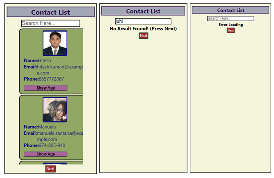
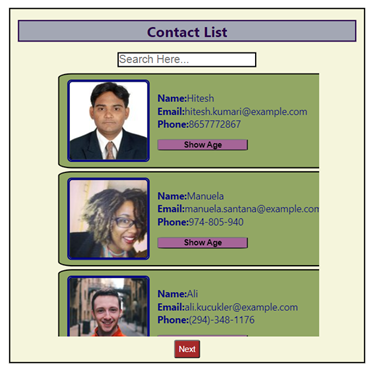

# Contact List App



## Overview

The Contact List App is a web application built with React that allows users to manage and view their contacts. The app integrates with an external API to fetch contact data dynamically. It provides features like a contact viewing, searching, showing contact age, responsive design, loading state, error handling and API pagination.

## Functionality
1. **API Integration**: The app integrates with the external API to fetch contact data in real-time. It uses Axios library for making HTTP requests to the API endpoints.
2. **Loading State**: While fetching data from the API, the app displays a loading spinner to indicate that the contacts are being loaded.
3. **Error Handling**: In case of any API request errors or failures, the app gracefully handles them and shows appropriate error messages to the user.
4. **View Contacts**: The app displays the list of contacts fetched from the API in a user-friendly and organized manner. Each contact is represented with basic information such as name, phone number, and email address.
5. **Search**: Users can use the search bar to find specific contacts based on their name or email address. The search function dynamically filters the contact list as the user types.
6. **Show Contact Age**: When a user clicks on a particular contact show age button, the app shows the contact's age if it's available in the contact data.
7. **Responsive Design**: The app is designed to be responsive and works well on various devices, including desktops, tablets, and smartphones.
8. **API Pagination**: To optimize performance, the app implements API pagination. It fetches and displays contacts in smaller batches, reducing unnecessary data transfer and providing a smoother user experience.

## Installation

1. Clone the repository to your local machine.
```
git clone https://github.com/juhikumarimodi6/React-Contact-list.git
```

2. Navigate to the project directory.
```
cd contact-list-app
```

3. Install dependencies using npm or yarn.
```
npm install
```
or
```
yarn install
```

4. Run the app locally.
```
npm start
```
or
```
yarn start
```

5. Open your web browser and visit `http://localhost:3000` to access the app.

## Demo
Check out the [Demo Video](ContactList-video.webm).

## Technologies Used
- React.js v18.2
- CSS
- React Hooks (useState())
- API fetch

## Contributing

Contributions to the Contact List App are welcome. If you find any issues or have suggestions for improvement, please create a new issue or submit a pull request.

## Contact

For any questions or inquiries, please contact [juhikumarimodi6@gmail.com](mailto:your-email@example.com).

---